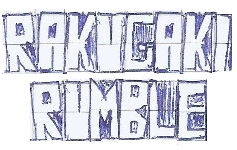

# Rakugaki Rumble
A small Godot 4.2 fighting game project, with a sketchbook aesthetic

## Controls

### P1:
* WASD = movement
* U = attack, confirm (also: I)
* O = install, cancel
* ESC = pause (also: Tab)

### P2:
* Arrows = movement
* Numpad1 = attack, confirm (also: Numpad2 J, K)
* Numpad3 = install, cancel (also: L)
* Numpad+ = pause (also: Numpad/)

### on joypad (P1: first connected device, P2: second device): 
* arrows = movement
* A = attack, confirm
* B = install, cancel
* start/select = pause
* keyboard controls are always active

### training mode hotkeys
* F1/LT: save state
* F2/RT: load state
* F3/RB: show hitboxes
* F4/LB: reset health, refill meter
* F5/R3: hide/show trainign data

### other controls
* ALT+ENTER: full screen - disabled during online matches!
* F10: disconnect from online match (experimental feature only)
* F11: display network diagnostic
* F12: screenshot (it will be saved in %appdata%\Godot\app_userdata\Rakugaki Rumble\screenshots) - disabled during online matches!

### Universal Mechanics (notation uses joypad buttons and numpad notation)
* 4: Backdash (8 frames of full invulnerability)
* 9: Forward jump (4 frames of full invulnerability)
* B (ground): Infinity Install (with full meter, cancels every grounded attack, lasts 2.5 seconds - removes the Bounce Limit and increases the momentum transfer from the walls)
* 2B (on the ground): Zero Install (with full meter, cancels every grounded attack, lasts 2.5 seconds - removes bounces all together but slashes damage down to 66%)
* B (while in air hit stun): Interrupt Stumble (with full meter. If performed without full meter, it will disable the super meter for the whole round) 
* j.2A: universal air spike, stops the opponent momentum and slams them to the ground on hit

### Movelist (notation uses joypad buttons and numpad notation)

#### Naomi Rukino
* A: Five Nails Death Slash (cancels into all Command Normals and Specials, jump cancel on hit)
* while walking forward A: Five Nails Dash Slash (forward jump cancel on hit)
* 2A: Skyward Scraper (cancels into all Specials, jump cancel on hit, auto-corrects side)
* j.A: Five Nails Air Slash
* j.2A: Armor Piercing Panther Kick (universal air spike)
* 236A: Cheetah Assault (startup is backdash-cancelable, cancels into Jaguar Knee on hit)
* [236A: Cheetah Spear (followup only, after any normal attack. No cancels)]
* j.236A: Air Cheetah Spear (cancels into j.2A on hit)
* 632A (or 22A): Jaguar Knee (cancels into j.236A on hit)

#### Rho-Zetta
* 5A/6A: Headbash (cancels into all Command Normals and Specials, jump cancel on hit)
* 4A: Turtling Headbash (same as Headbash, but has invulnerable startup and less damage)
* 2A: The Pit and the Pendulum (cancels into all Specials, jump cancel on hit, auto-corrects side)
* j.A: Spikes and Yikes (cancels into Run Amok Rampage on hit)
* j.2A: Weight of the World (universal air spike)
* 46A: Run Amok Rampage (2 hits, cancels into 2A on hit, forward jump cancel on hit, can be performed from back dash)

### Gridd Deadmetal
* A: Drill Swipe (cancels into all Command Normals and Specials including Fast Boost, jump cancel on hit)
* 2A: Head Ram (cancels into all Specials including Fast Boost, jump cancel on hit, auto-corrects side)
* j.A: Air Swipe (cancels into Terrordriller and Fast Boost on hit)
* j.2A: The Mechon's Elbow (universal air spike)
* AAA: Terrordriller (can be mashed on on hit)
* j.B: Air Boost (only on forward jump, costs meter, can't be performed without meter)
* B (only during any install): Fast Boost (doesn't cost any meter, cancels any ground attack on hit, can be performed during any jump or on the ground)
* A (during Air Boost or Fast Boost): Drill Smash (cancels into Terrordriller on hit, no meter gain on hit)

### Whitechapel Esmeralda
* [her back jump has startup invulnerability]
* A: Gibbous Moon (cancels into all Command Normals and Specials, jump cancel on hit)
* 2A: Entropy Burst (cancels into all Specials, jump cancel on hit, auto-corrects side, can be back-dash canceled on startup)
    * 2A : Entropy Encore (jump cancel on hit, cancels into all Specials and into itself)
* j.A: Gibbous Moon (halts air momentum, cancels into Air Entropy Burst)
* j.2A: Ascension Step (universal air spike, cancels into Entropy Encore, has startup invul)
* j.412A: Entropy Burst (jump cancel on hit, cancels into all Specials and Entropy Encore)
* 236A: Blame the Night (if Whitechapel has enough meter, this move will throw a projectile. Two projectiles during install, air ok. The palm hitbox can be jump canceled on hit)
* 236[A]: Blame the Night Minus (forces non-projectile version, air ok, can be jump canceled on hit)
* j.214A: Twilight Snack (if Whitechapel has enough meter, this move will throw a projectile. Two projectiles during install, air ok. The palm hitbox can be jump canceled on hit)
* j.214[A]: Twilight Snack Minus (forces non-projectile version, can be jump canceled on hit)

### Basic combo structure:
* hitting the opponent during the start of their hitstun frames floats them. A sample starter can be either A > 2A, 2A > 236A or e.g. A > 236A
* then, hit them before they hit the ground. Every wall hit reverses the momentum of the character that was hit 
* max 2 bounces per combo before wall splat, unless Infinity Install is active
* currently there is no block. Backdash (4), Forward Jump (9) have startup invulnerability

### Extra remarks
* the input buffer accepts negative edge inputs for specials
* ONLINE MULTIPLAYER IS STILL EXPERIMENTAL! Watch out, there might be one-sided rollbacks! 
* it works via direct IP connection -> use Radmin VPN or Hamachi for the best results
* Auto Button Masher is a DEBUG setting that will replace a player with a randomly mashing CPU opponent - DON'T use it online unless you are heavy on trolling
* All characters have a CPU with 3 levels

***

# LICENSE

## CODE

### Snopek Rollback Addon for Godot (./addons/godot-rollback-netcode/)

Copyright (c) 2021-2022 David Snopek

Permission is hereby granted, free of charge, to any person obtaining a copy
of this software and associated documentation files (the "Software"), to deal
in the Software without restriction, including without limitation the rights
to use, copy, modify, merge, publish, distribute, sublicense, and/or sell
copies of the Software, and to permit persons to whom the Software is
furnished to do so, subject to the following conditions:

The above copyright notice and this permission notice shall be included in all
copies or substantial portions of the Software.

THE SOFTWARE IS PROVIDED "AS IS", WITHOUT WARRANTY OF ANY KIND, EXPRESS OR
IMPLIED, INCLUDING BUT NOT LIMITED TO THE WARRANTIES OF MERCHANTABILITY,
FITNESS FOR A PARTICULAR PURPOSE AND NONINFRINGEMENT. IN NO EVENT SHALL THE
AUTHORS OR COPYRIGHT HOLDERS BE LIABLE FOR ANY CLAIM, DAMAGES OR OTHER
LIABILITY, WHETHER IN AN ACTION OF CONTRACT, TORT OR OTHERWISE, ARISING FROM,
OUT OF OR IN CONNECTION WITH THE SOFTWARE OR THE USE OR OTHER DEALINGS IN THE
SOFTWARE.

### Repository content (excluding assets)

All scripts (.gd) and scenes files (.tscn) in the "./scripts/" and "./media/" folders and related sub-folders are released under the following license (MIT):

Copyright (c) 2024 Andrea Demetrio

Permission is hereby granted, free of charge, to any person obtaining a copy of this software and associated documentation files (the “Software”), to deal in the Software without restriction, including without limitation the rights to use, copy, modify, merge, publish, distribute, sublicense, and/or sell copies of the Software, and to permit persons to whom the Software is furnished to do so, subject to the following conditions:

The above copyright notice and this permission notice shall be included in all copies or substantial portions of the Software.

THE SOFTWARE IS PROVIDED “AS IS”, WITHOUT WARRANTY OF ANY KIND, EXPRESS OR IMPLIED, INCLUDING BUT NOT LIMITED TO THE WARRANTIES OF MERCHANTABILITY, FITNESS FOR A PARTICULAR PURPOSE AND NONINFRINGEMENT. IN NO EVENT SHALL THE AUTHORS OR COPYRIGHT HOLDERS BE LIABLE FOR ANY CLAIM, DAMAGES OR OTHER LIABILITY, WHETHER IN AN ACTION OF CONTRACT, TORT OR OTHERWISE, ARISING FROM, OUT OF OR IN CONNECTION WITH THE SOFTWARE OR THE USE OR OTHER DEALINGS IN THE SOFTWARE.

**Notice that the above license does not apply to the assets (textures, sounds, music, animations) used as a resource by the scenes in questions**

## ASSETS

All the resources (.res, .tres), textures and images (.png, .jpg.), sounds (.ogg, .wav), and music (.ogg, .wav, .mp3) in the repository or in any sub-folder except "./addons/" are available for PERSONAL USE only and CANNOT BE REDISTRIBUTED without explicit permission of the author.

## CHARACTERS AND INTELLECTUAL PROPERTY

The game "Rakugaki Rumble", the characters, their appearance, likeness and usage remain an intellectual property of Andrea Demetrio and cannot be reused without permission. Fan art and fan works depicting said characters are hereby **authorized**, as long as they are clearly marked as non-official and that they do not use the original character assets.
The original character assets (such as sprites, sounds and textures) are available upon direct request for non-profit projects (such as M.U.G.E.N or I.K.E.M.E.N. non-commercial games and compilations). For inquiries, contact me at the following email 

mondhase.projects ==at== outlook (dot) com 

### Copyright (c) 2024 - der Mondhase - Game Development and Related Media

### Copyright (c) 2024 - Andrea Demetrio